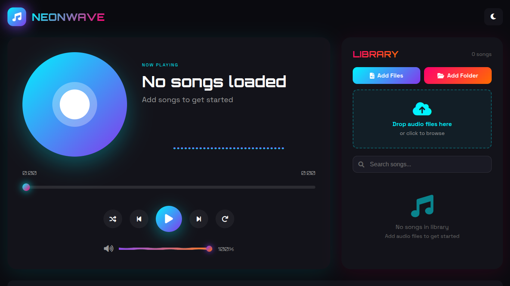
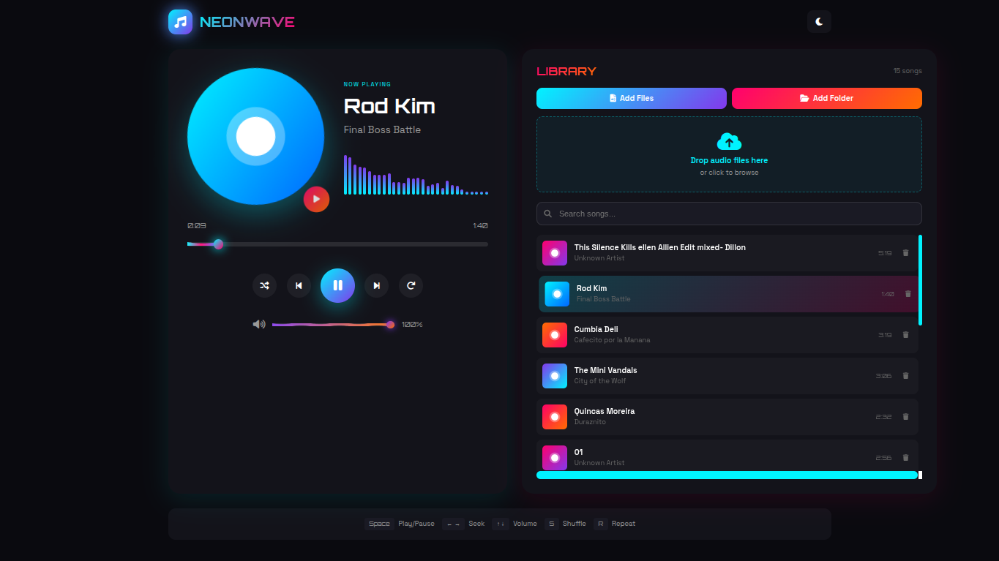
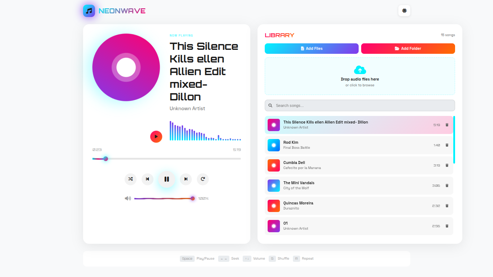

# NEONWAVE Music Player

A simple, elegant, and intuitive music player with a stunning neon-futuristic interface. Enjoy your favorite music with a beautiful audio visualizer and a seamless user experience.

## Previews

Here's a glimpse of NEONWAVE in both dark and light themes:

### Dark Theme

### Light Theme

## Features

- **Multiple Ways to Add Music:**
    - Click **"Add Files"** to select individual songs.
    - Click **"Add Folder"** to import an entire directory of music.
    - **Drag and Drop** your audio files directly onto the app.
- **Smart Metadata:** Automatically reads and displays the song title, artist, and duration.
- **Dynamic Library:**
    - Instantly search for any song in your playlist.
    - View the total number of songs.
    - Easily remove songs from the library.
- **Audio Visualizer:** A real-time visualizer that dances to your music.
- **Playback Controls:** All the essentials including play/pause, next/previous, shuffle, and repeat.
- **Stunning UI:**
    - **Light & Dark Themes:** Switch between themes to match your mood.
    - **Animated Player:** The album art spins while music is playing.
    - **Generated Art:** Generates beautiful placeholder art for songs without a cover.
- **Keyboard Shortcuts:** Control your music playback without leaving your keyboard.

## How to Use

1.  **Add Your Music:**
    - Click the **"Add Files"** button to open a file dialog and select one or more audio files.
    - Click the **"Add Folder"** button to select a directory containing your music. All supported audio files will be imported.
    - Alternatively, just drag and drop your music files onto the "Drop audio files here" zone.
2.  **Play Music:**
    - Once songs are added, they will appear in the library on the right.
    - Click on any song in the list to start playing it.
    - Use the controls at the bottom of the player to play, pause, skip, shuffle, or repeat tracks.
3.  **Search Your Library:**
    - Use the search bar above the song list to filter your music by title or artist.

## Keyboard Shortcuts

| Key | Action |
|---|---|
| `Space` | Play/Pause |
| `←` / `→` | Seek Backward/Forward |
| `↑` / `↓` | Increase/Decrease Volume |
| `S` | Toggle Shuffle |
| `R` | Toggle Repeat |

---

Subscribe to [my YouTube channel](https://www.youtube.com/channel/UCLJlHz_F9Fg5amSvtDo9AnA) for more awesome projects!